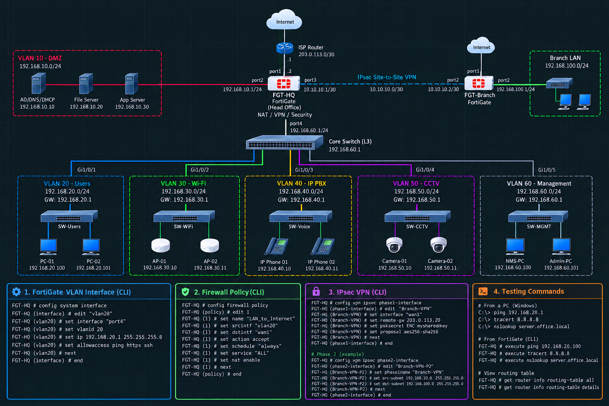
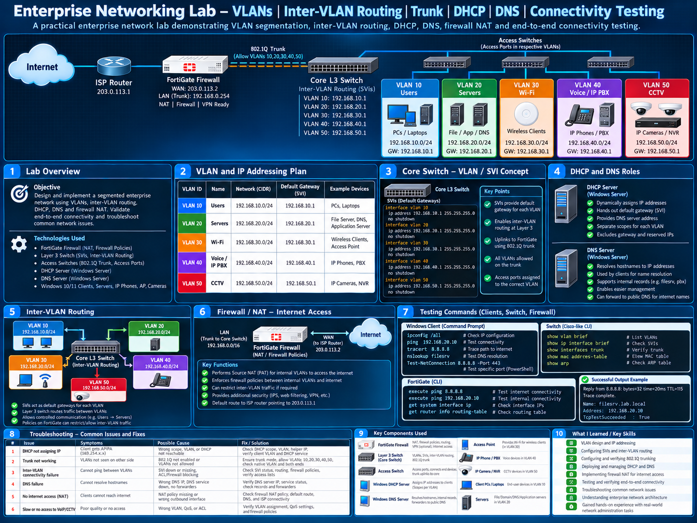

# Networking Labs

This section contains hands-on networking labs and technical documentation.

Topics Covered

- LAN/WAN
- VLANs
- Trunking
- Inter-VLAN Routing
- TCP/IP
- DNS
- DHCP
- Routing & Switching
- IP Addressing
- Network Troubleshooting
- Connectivity Testing

## Lab Diagrams

