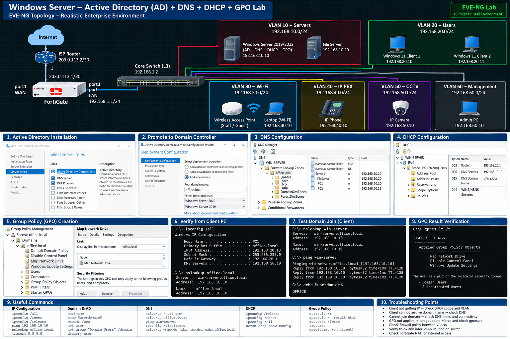

# Windows Server Labs

This section contains Windows Server administration labs and technical documentation.

Topics Covered

- Windows Server 2019/2022
- Active Directory Domain Services (AD DS)
- User & Group Management
- Organizational Units (OU)
- Group Policy (GPO)
- DNS
- DHCP
- File & Folder Permissions
- Shared Folders
- Windows Server Roles & Features
- Windows Updates & Patching
- Backup & Recovery
- Hyper-V
- Server Troubleshooting

## Lab Diagram

