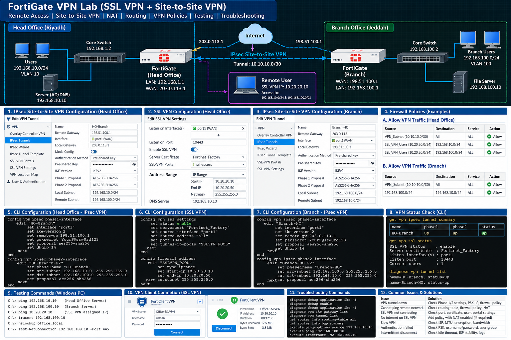

# VPN Labs

This section contains VPN configuration labs, documentation, and troubleshooting practice.

Topics Covered

- IPsec Site-to-Site VPN
- Remote Access VPN
- SSL VPN
- VPN Phase 1 Configuration
- VPN Phase 2 Configuration
- Encryption & Authentication
- Pre-Shared Key Configuration
- VPN Routing
- Firewall Policies for VPN
- NAT Exemption
- VPN Connectivity Testing
- VPN Logs & Monitoring
- VPN Troubleshooting

## Lab Diagram

