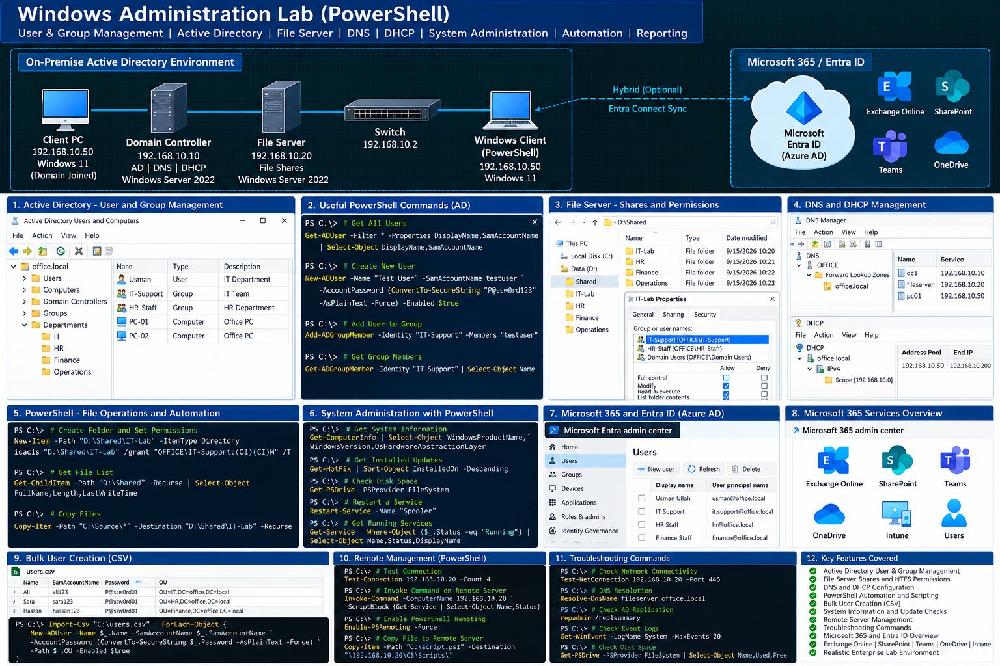

# PowerShell Labs

This section contains PowerShell scripts, administration practice, and automation examples.

Topics Covered

- PowerShell Fundamentals
- Command and Cmdlet Usage
- Variables and Operators
- Pipelines
- Functions
- User Management
- Active Directory Administration
- Windows Server Administration
- Microsoft 365 Administration
- Exchange Online PowerShell
- File and Folder Automation
- System Information Commands
- Service Management
- Network Troubleshooting Commands
- Administrative Automation
- PowerShell Troubleshooting

## Lab Diagram

