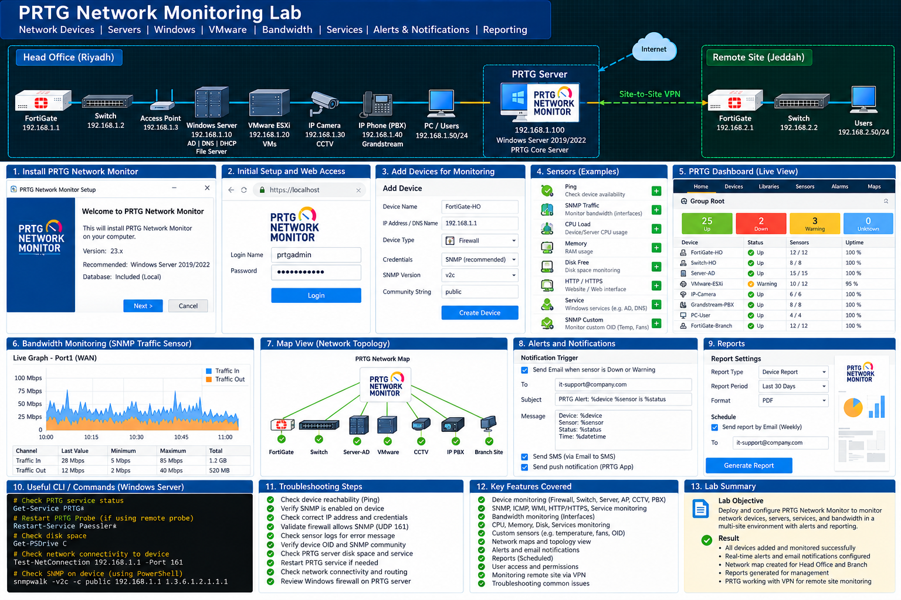

# Monitoring Labs

This section contains network and system monitoring labs, tools, and troubleshooting documentation.

Topics Covered

- PRTG Network Monitor
- Device Monitoring
- Server Monitoring
- Network Availability Monitoring
- Bandwidth Monitoring
- Interface Monitoring
- CPU & Memory Monitoring
- Uptime Monitoring
- Alerts & Notifications
- SNMP Monitoring
- Ping Monitoring
- Service Monitoring
- Logs & Events
- Performance Analysis
- Monitoring Troubleshooting

## Lab Diagram

