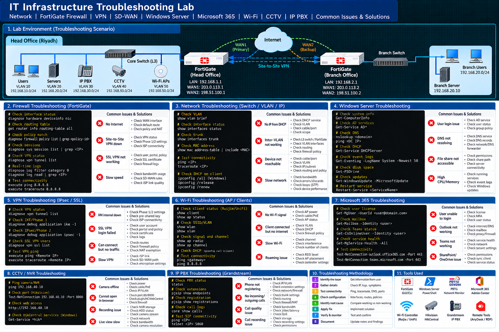

# IT Troubleshooting Labs

This section contains practical troubleshooting scenarios, diagnostic steps, and technical documentation for network, system, firewall, and infrastructure issues.

Topics Covered

- Network Connectivity Troubleshooting
- IP Addressing Issues
- DNS Troubleshooting
- DHCP Troubleshooting
- VLAN & Trunk Troubleshooting
- Inter-VLAN Routing Issues
- Firewall Policy Troubleshooting
- NAT Troubleshooting
- VPN Troubleshooting
- Windows Server Troubleshooting
- Active Directory Issues
- Microsoft 365 Troubleshooting
- Server & Service Connectivity
- Ping & Port Testing
- PowerShell Diagnostic Commands
- PRTG Monitoring Alerts
- Wi-Fi Connectivity Issues
- CCTV/NVR Network Troubleshooting
- IP PBX Connectivity Troubleshooting
- Root Cause Analysis

## Lab Diagram

